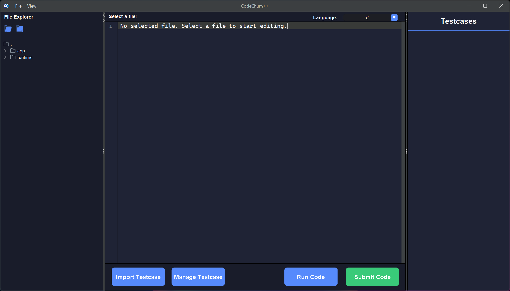
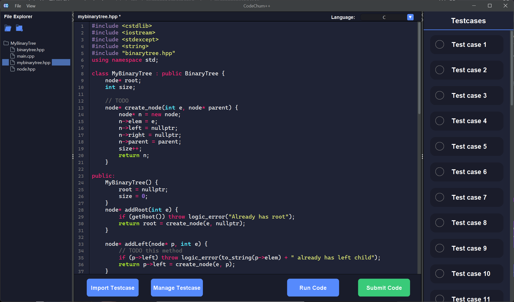
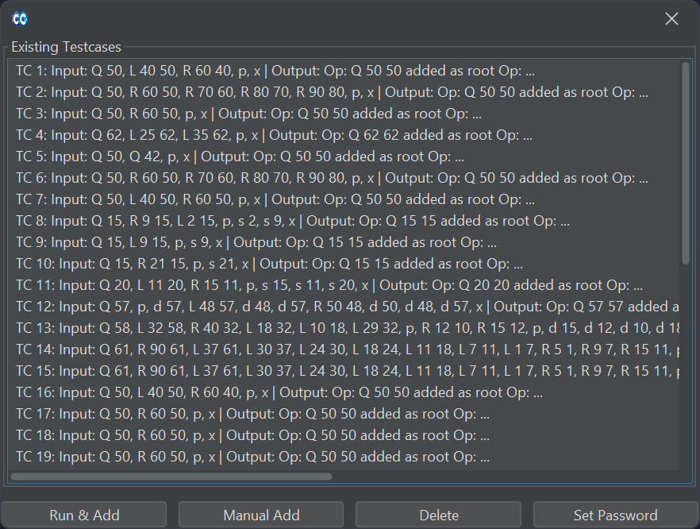
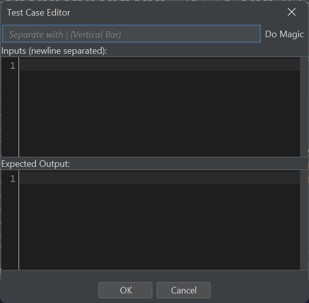
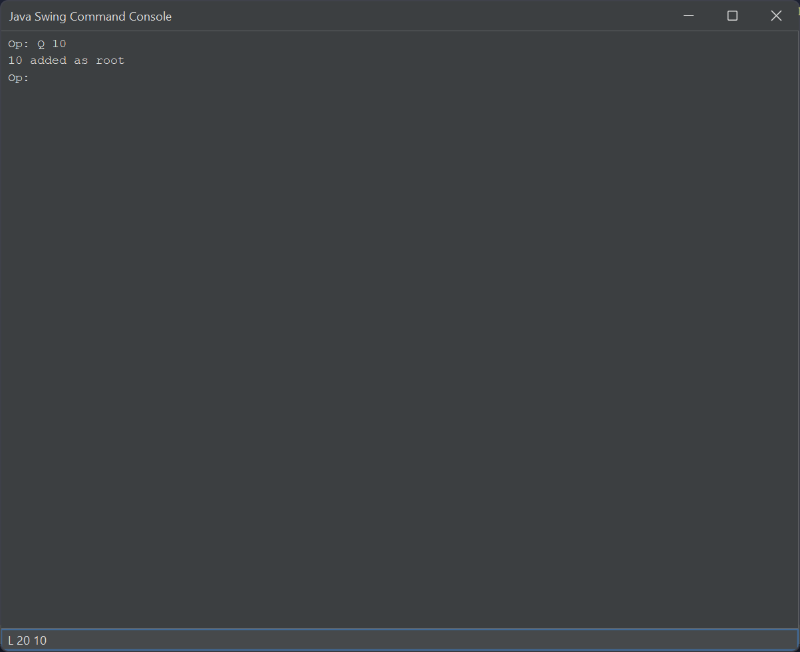
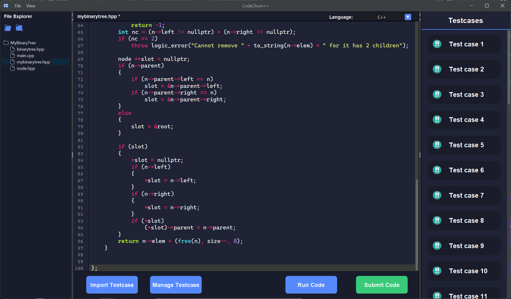
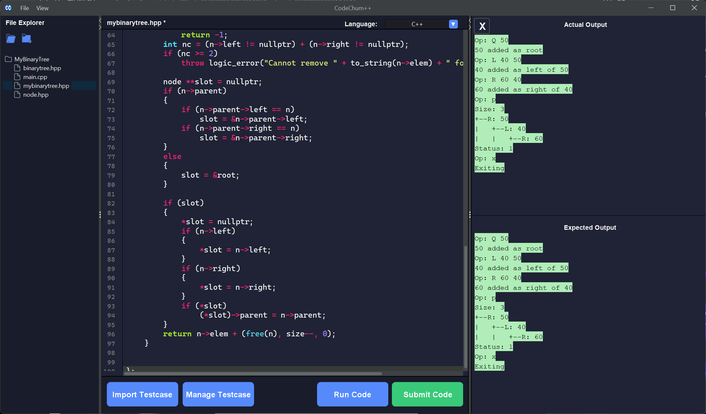

# CodeChum++
**The Fastest and Most Reliable Offline Code Judger**

CodeChum++ is a lightweight, standalone code-judging environment built with Java Swing. It provides an efficient workspace to write, run, and evaluate code instantly without an internet connection.

## Table of Contents
- [The .ccpp File Format](#the-ccpp-file-format)
- [Features](#features)
- [Dependencies & Requirements](#dependencies--requirements)
- [Documentation](#documentation)
- [Installation](#installation)
- [Application Preview](#application-preview)
    - [1. Main Editor](#1-main-editor)
    - [2. Challenge Loading](#2-challenge-loading)
    - [3. Testcase Management & Creation](#3-testcase-management--creation)
    - [4. Manual Add Dialog](#4-manual-add-dialog)
    - [5. Interactive Execution](#5-interactive-execution)
    - [6. Submission & Judging](#6-submission--judging)
    - [7. Output Difference (Diff)](#7-output-difference-diff)
- [Architecture & Design](#architecture--design)
    - [OOP Principles & Class Hierarchy](#oop-principles--class-hierarchy)
    - [Design Patterns](#design-patterns)
    - [Concurrency & Performance](#concurrency--performance)
- [Class Diagram](#class-diagram)

## The .ccpp File Format
The core of the CodeChum++ ecosystem is the `.ccpp` file. This is a custom, encrypted, and integrity-verified file format designed for secure problem sharing between teachers and students.

A `.ccpp` file acts as a collection of infinite testcase pairs (input and expected output). These files can be generated in two ways:
1. **Golden Code Execution:** Run a reference program and interact with it to automatically capture inputs and outputs.
2. **Manual Entry:** Manually define input sets and their corresponding expected outputs.

This format positions CodeChum++ as a free, open-source, and decentralized platform for offline competitive programming and classroom exercises.

## Features
* **Multi-Language Support:** Execute and judge Java, C, C++, and Python.
* **Integrated File Management:** Full file tree navigation to manage project directories.
* **Automated Judging:** Securely verify code against encrypted `.ccpp` testcases.
* **Diff Engine:** High-precision comparison between actual program output and expected results.
* **Open Source:** A transparent and community-driven alternative to online platforms.

## Dependencies & Requirements
To use the code-judging features, the following compilers and interpreters must be installed on your system and added to your Environment Path:

| Language | Required Dependency |
| :--- | :--- |
| **Java** | JDK 17 or higher |
| **C / C++** | GCC (MinGW-w64) or Clang |
| **Python** | Python 3.x |

## Documentation
Detailed technical specifications and usage guides are available in the [Project Wiki (TODO)](../../wiki).

## Installation
1. Download the latest release.
2. Ensure the required compilers (GCC/Python/JDK) are installed.
3. Run the application and import a `.ccpp` file to get started.

## Application Preview

### 1. Main Editor
The landing page features a streamlined text editor designed for focus and speed.

### 2. Challenge Loading
Demonstrating a `.ccpp` file imported and loaded, ready for the user to begin coding.

### 3. Testcase Management & Creation
The interface for editing `.ccpp` files, allowing users to generate testcases via "Golden Code" interaction or manual definitions.

### 4. Manual Add Dialog
A dedicated dialog for manually inputting newline-separated inputs and their expected outputs.

### 5. Interactive Execution
The built-in terminal allows users to run and interact with their code in real-time before submission.

### 6. Submission & Judging
The judge processes the code against the `.ccpp` testcase collection to determine correctness.

### 7. Output Difference (Diff)
A detailed view comparing the actual output of the user's program against the expected output of the testcase.

## Architecture & Design
CodeChum++ is built with a strong emphasis on Object-Oriented Programming (OOP) and high-performance execution patterns to ensure the codebase remains maintainable and the judging engine remains responsive.

### OOP Principles & Class Hierarchy
* **Inheritance & Polymorphism (CCFile):** One example is the `CCFile` class serves as the foundation for file handling. Through inheritance, specialized file types extend `CCFile` to implement different behaviors for `.ccpp` file and normal files, while allowing the rest of the application to interact with them polymorphically.
* **Encapsulation:** Core judging logic and file handling are shielded within dedicated modules, exposing only necessary interfaces to the GUI.
* **Abstraction:** The Judge Engine abstracts the complexities of cross-platform process execution, allowing the app to handle Java, C, C++, and Python through a unified interface.

### Design Patterns
* **Singleton Pattern:** Utilized for the **FileManager**. This ensures a single, globally accessible instance manages all I/O operations and file integrity checks, preventing resource conflicts across the application.
* **Builder Pattern (Fluent API):** Implemented in the **SubmissionRecord** class. By returning `this` in setter methods, the engine can build or update a record using method chaining (e.g., `.setVerdict().setOutput()`). This provides a clean, successional way to prepare submission data before it is returned by the judge or displayed in the UI.

### Concurrency & Performance
* **Parallel Testcase Execution:** To achieve ultra-fast results, CodeChum++ utilizes **Multithreading**. The engine dispatches multiple testcases in parallel across available CPU cores, significantly reducing total judging time for large `.ccpp` collections.
* **CCFile Caching:** To minimize disk I/O latency, CodeChum++ implements **Caching** within the `CCFile` system. Frequently accessed or currently open files are cached in memory, ensuring near-instantaneous read/write operations during the coding and judging phases.
* **Asynchronous UI:** The judging process runs on background worker threads, ensuring the JSwing graphical interface remains responsive and fluid while code is being evaluated.

## Class Diagram
[Class Diagram](docs/imgs/class_diagram.png)